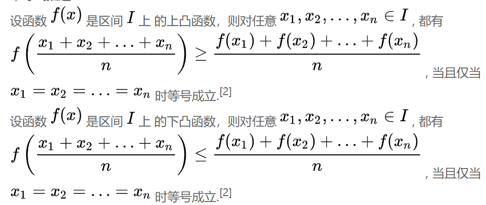

## Diffusion Model

[best video](https://www.bilibili.com/video/BV1b541197HX?spm_id_from=333.337.search-card.all.click&vd_source=7aa0fd62e4ebf920df044126e7692b68)

[slides](https://t.bilibili.com/700526762586538024?spm_id_from=333.999.0.0)

### Math(Probability and KL divergence)

**conditional probability**

**Markov probability**

**KL divergence**

KL散度的计算公式 (离散)：
$$ D(P||Q)=\sum_x p(x)*log(\frac{p(x)}{q(x)})$$
KL散度的计算公式 (连续)：
$$ D(P||Q)=\int {P(x)*log(\frac{P(x)}{Q(x)})dx} $$

两个Gaussian Distribution的KL散度可以显示计算：

**Reparameterization**

**琴生不等式**

也可以用 **均值** 的语言来描述：
$$ f(E(x)) \ge E(f(x)) \quad (convex)$$ 
$$ f(E(x)) \le E(f(x))  \quad  (contour)$$ 

****

### VAE(max log-likelihood)

VAE的核心还是最大化 $log(p(x))$（maxize log-likelihood）
$$ p(x)=\int p_{\theta}(x|z)*p(z)dz = \int q_{\phi}(z|x)\frac{p_{\theta}(x|z)p(z)}{q_{\phi}(z|x)}dz = E_{z\sim q_{\phi}(z|x)} [\frac{p_{\theta}(x|z)p(z)}{q_{\phi}(z|x)}]$$
(*PS* ：上式中间只是分子分母同乘，**注意最后这一步转期望**)

所以有：

上面的不等式用的是**琴生不等式**

于是可以有：
$$ E_{z\sim q_{\phi}(z|x)}[log(\frac{p_{\theta}(x|z)p(z)}{q_{\phi}(z|x)})] = E_{z\sim q_{\phi}(z|x)}(log(\frac{p(z)}{q_{\phi}(z|x)}))+E_{z\sim q_{\phi}(z|x)}(log (p_{\theta}(x|z)))$$

等式右边，第一项就是可以两个高斯分布的KL散度，第二项可以用MSE之类的直接enforce alignment就行了。

****

### Diffusion Model

**Overview**

****

**Diffusion Process**

**Attention**
 - $\beta$ 的数值是不断增大的，也就是越到后面，加入的噪声越大
 - diffusion过程可以一步到位：

****

**Reverse Process**

****

**MAX log-likelihhod**

****

**code**

