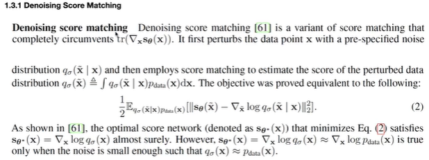
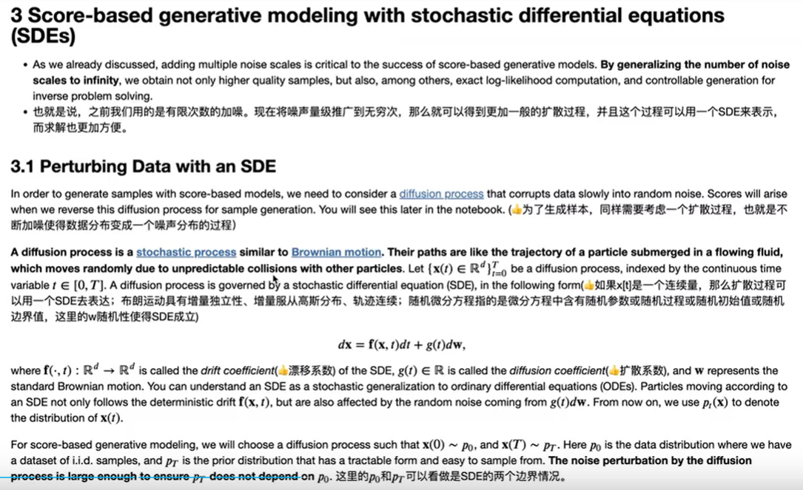

## ScoreDiffusionModel

Nightmare.

[paper](https://arxiv.org/pdf/2011.13456.pdf) 
[refenrence](https://www.bilibili.com/video/BV1Dd4y1A7oz/?spm_id_from=333.788&vd_source=9c6d95442eaa08adb6f5c78841910257)
#### Basics

**score and scoreNet**

- *score* -- 对数似然的梯度
- *scoreNet* -- 预测**x**的score

**Langevin Dynamics**

一种依赖于分布的**score**的采样方法

*总结*：
- 采样公式
$$x_t=x_{t-1}+\frac{\epsilon}{2}\nabla_x log(p(x_{t-1}))+\sqrt{\epsilon}z_t$$
- 先验分布$\pi$可以是任意分布
- $\epsilon \rightarrow 0$ 并且 $T \rightarrow \infty$时，就完成了一个近似于$P_{data}(x)$的采样
- 为了能够有准确的近似，还需要对于**score**有准确的估计。（并不需要对于$P_{data}(x)$有准确的估计）

**Score Matching**

*Goal* -- 预测的结果和真实相近。

- 核心问题转化为：
$$\frac{1}{2}E_{p_{data}}[ ||s_{\theta}(x)-\nabla_x log(p_{data}(x))||^2_2]$$
- 后面的转化似乎根本没有用到？

****

**Denoising Score Matching**

没看懂这里的equation是怎么导出的

**challenges**

**如果只加一个很小的噪声？**

数据密度比较低的区域，估计的score不准确，所以可能导致采样也不准确

为了解决上面说的数据密度比较低的区域，估计的score不准确的问题，把噪声加的更大，对于加噪后的密度有一个比较准确的估计，但是这个时候和原本的数据相差就比较大了。

**解决方案？**--使用不同量级的噪声，先用高噪声，解决密度比较低的区域面临的梯度不准确的问题（我认为有可能是梯度消失？）。然后再逐渐退火到低噪声

****

**Noise Conditional Score Networks(NCSN)--overview**

- $\{\sigma_i\}_{i=1}^L$是递减的正等比数列
- $q_\sigma(x)=\int p_{data}(t) N(t,\sigma^2 I)dt$
- 训练的目标是：
$$s_\theta(x,\sigma)=\nabla_x log (q_\sigma(x))$$
- 为什么叫**conditional**? -- 因为输入不仅和x相关，还和当前的**noise**相关

****

**Noise Conditional Score Networks(NCSN)--design**

- $\sigma$的设计

一开始加噪声很小的时候，下面图是对于分数的估计，不是很准确，但是当噪声加比较大的时候，就比较准确了

- **denoising score matching**算法
由于已知  $q_\sigma(x)=\int p_{data}(t) N(t,\sigma^2 I)dt$，所以可以直接显示计算出
$$ \nabla_{\tilde{x}} log(q_{\sigma}(\tilde{x}|x))=-\frac{\tilde{x}-x}{\sigma^2}$$
所以就等同于优化：

上面公式中的$\lambda$用于平衡各个loss term，保证在同一个量级。

- $\lambda$权重数值的选取：$$ \lambda(\sigma)=\sigma^2$$

原因如下：

****

**NCSN inference via annealed Langevin Dynamics**

- 每一次迭代都是在给下一次迭代提供更好的初始化。每一次迭代都是对噪声的一次消除。虽然我实在不理解这个东西工作的原理。
- **$\alpha_i$的选择** -- 目标是固定住**信噪比**的量级

****
**Score-based generative modeling with stochastic differential equations(SDE)**

把扩散推广为连续扩散。可以认为DDPM就是一种特殊的SDE，刚刚的NCSN也是

- 扩散过程的随机可微方程
$$ dx = f(x,t)dt + g(t) dw$$
- 其中$f(x,t)$是漂移系数。$g(t)$是扩散系数
- 一般用$x(0) \sim p_0$和$x(T)\sim p_T$作为SDE的两个边界情况
- 上面这个式子的逆SDE为：

- 要优化的函数转变为：

****

**连续时间网络设计**

- 使用Unet
- 高斯随机特征替代时间编码

## ISSUE
- 那个选取$q_\sigma(\tilde{x})$的函数真的不是高斯核函数吗？如果是的话，后面很多东西都可以靠直觉直接解释了..
- 信噪比是什么

## CODE
实现一般形式

**Score Net**

