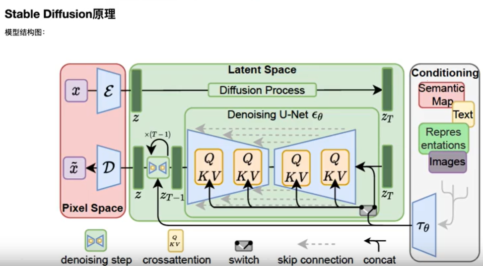

## Stable Diffusion

[paper](https://arxiv.org/pdf/2112.10752.pdf)
[web](https://huggingface.co/CompVis/stable-diffusion)可以试用一些conditioned generation的功能

**overview**

- 相比于Vanilla Diffusion Model，选择在**latent space**中做diffusion.（数据降维，节约计算资源）
- 会首先预训练一个VAE（encoder和decoder），用于latent feature的编码解码
- 支持**conditional generation**.

# todo
conditional generation的实现方式

