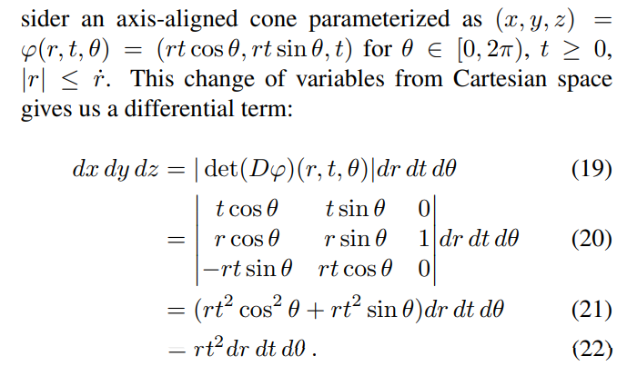
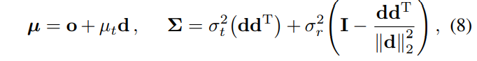
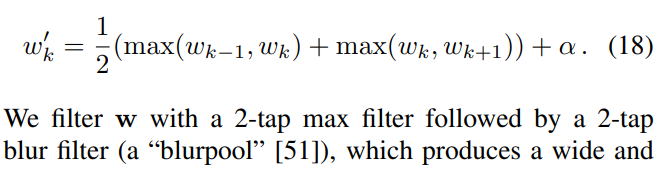

## MipNeRF

[paper](https://arxiv.org/pdf/2103.13415.pdf)

### Intro

Vanilla NeRF samples points **x** along rays that are traced from the camera center of projection through each pixel. Mip-NeRF instead reasons about **3D conical frustum** defined by camera pixel.

>  These conical frustums are then featurized with our integrated positional encoding (IPE), which works by approximating the frustum with a multivariate Gaussian and then computing the (closed form) integral E[γ(x)] over the positional encodings of the coordinates within the Gaussian.

人言：用conical frustum取代原来的单点sample，为了计算的便捷性，把conical frustum视作Gaussian分布，计算positional encoding的时候就使用这个分布的positional encoding的均值。

[positional encoding的相关讨论](../NeRF/NeRF.md)

### Method

**高斯分布推导**
核心思路是，如果把一个conical frustum看作一个高斯分布，就先计算出x,y,z（这里的z就是视线作为axis）的均值，和二阶均值，然后找一个满足这个均值和二阶均值的高斯分布作为近似结果

首先，求一个**体积微元** (符号可以参考最上面那个图)

把**体积**积出来

就可以暴力计算t（也就是z）的E，二阶E

然后可以利用**高斯分布的特性**：t的均值就是E(t)，而t的方差用下面这个公式：

可以得到：

x的计算完全同理。可以得到**最后的高斯表达式**

****

**IPE计算**

positional encoding取高斯分布下的positional encoding的均值.就是一大堆非常繁琐的计算：

****

**Multi-Scale and Anti-aliasing**

没太看懂这个mip-nerf能够适应各种scale是说什么。但是由于mip-nerf是考虑整个conical frustum, 可以肯定他的anti-aliasing功能，因为他可以过滤掉高频的噪声。

由于mip可以适应各种scale，所以他不需要两个mlp，一个学fine一个学coarse.所以可以节约一半内存。所以在实验中，coarse比vanilla nerf多sample了64个点。

但是mip-nerf依然保留coarse和fine的sample.稍微有一点不一样的是，对w进行了**blur filter**。

> which produces a wide and smooth upper envelop before renormalization. and the alpha parameter here ensures that samples are drawn in empty regions of space.

