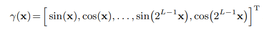

### Positional Encoding

NeRF **Positional Encoding**的公式：

> it allows the MLP parameterizing the scene to behave as an interpolation function, where L determines the **bandwidth** of the interpolation kernel.

本质应该是傅里叶分解。