## Reinforcement Learning

[source](https://www.bilibili.com/video/BV1UE411G78S?spm_id_from=333.337.search-card.all.click&vd_source=9c6d95442eaa08adb6f5c78841910257)
[source2](https://www.youtube.com/watch?v=vmkRMvhCW5c)  (I believe this is one of the best tutorials for RL.)

### Lecture 1

**Why Reinforcement?**
- supervised : 很多时候人的决策也不一定是最优的。这样学出来的agent不一定是最厉害的(learning from **teacher**)
- reinforcement : learning from **experience**

In fact, alpha Go is a combination of Reinfrocement learning and supervised learning.

Other settings: chat-bot, interactive retrieval, auto-vehicle, text-generation.

****

**Terminology**

****

**RL Method1->Value-based**

**Deep Q-Network & TD Algorithm**

- goal: win the game.
Motivation: If we know $Q^*(s_t,a_t)$, then what is the best action for the current situation?
$$a^* = argmax_a Q^*(s,a)$$

So, the intuition is that, we can use a neural network $Q(s_t,a_t;w)$ to estimate $Q^*$.

**Temporal Difference Learning(TD Algorithm)**
最基本的公式就是下面这个：
$$Q(s_t,a_t;w) \approx r_t +\gamma Q(s_{t+1},a_{t+1};w)=y_t$$
就是要注意一下这里的$a_{t+1}$的选取，应该是选择：
$$a_{t+1}=argmax_a Q(s_{t+1},a;w_t)$$
所以loss可以表达为：
$$L_t=\frac{1}{2}[Q(s_t,a_t;w)-y_t]^2$$
于是梯度可以计算为：
$$\frac{\partial L_t}{\partial w}=(Q(s_t,a_t;w)-y_t)\frac{\partial Q(s_t,a_t;w)}{\partial w}$$

**算法流程**
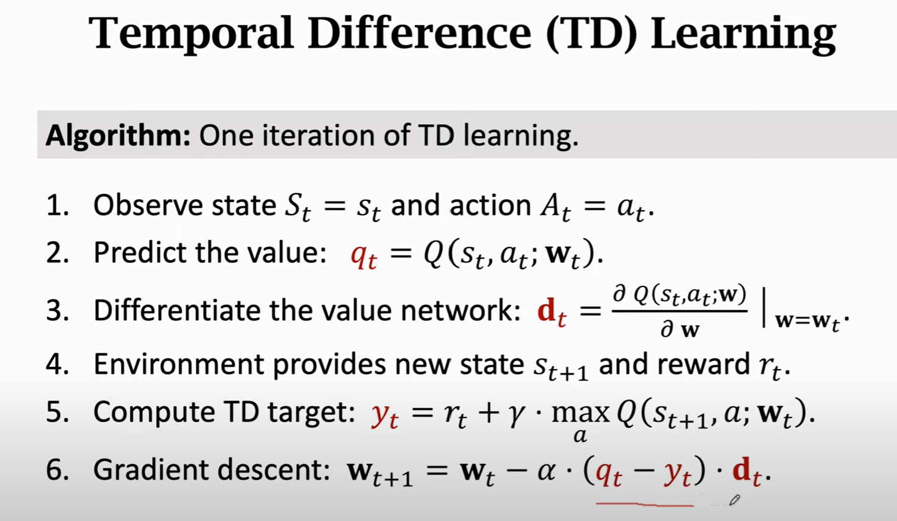

****

**RL Method2->Policy-based**

Hint: estimate $\pi (a|s)$ using a **Policy Network $\pi (a|s;\theta)$**

**Network Architecture**
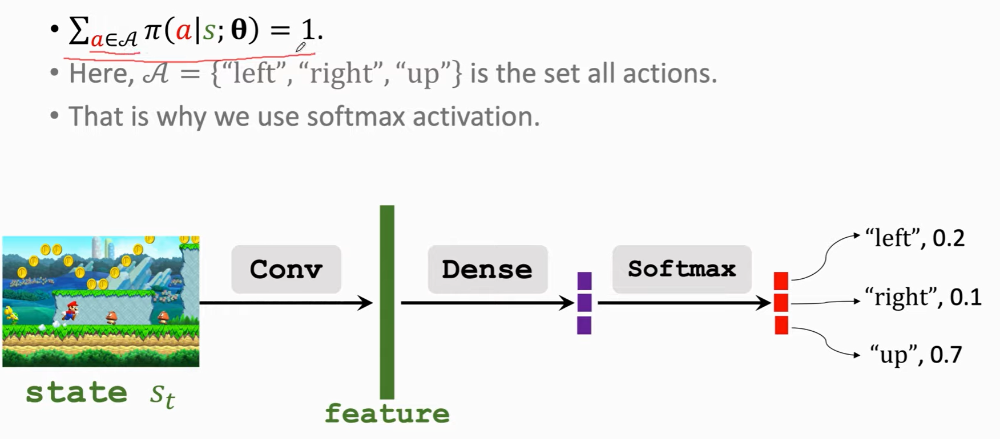

回顾之前的一些公式：
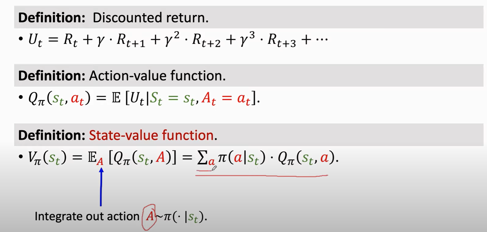
- action-value function: 在当前策略和环境下，衡量各种动作的好坏
- state-value function: 在当前策略下，评估当前环境的好坏
  
policy-based的核心是优化state-value function.希望寻找到一个策略，让当前环境最友好

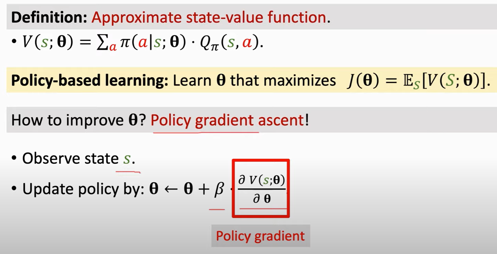

于是问题就主要是，如何计算这个**policy gradient**

**Policy Gradient**

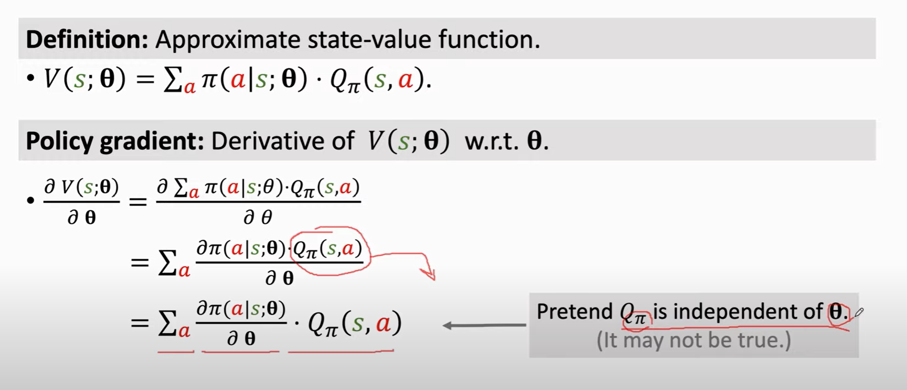
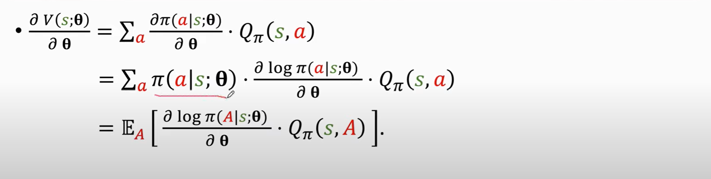

于是可以得到：

这里其实就构造出了一个期望，给了我们**蒙特卡洛采样**的条件

但是还有一个问题：$Q_{\pi}(s,A)$如何计算呢？

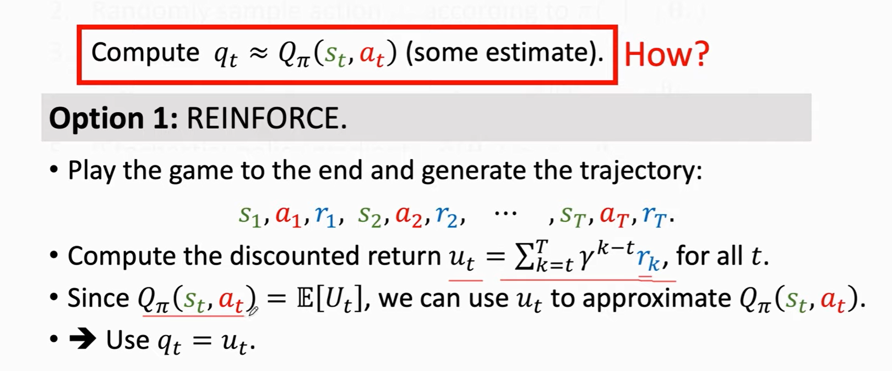
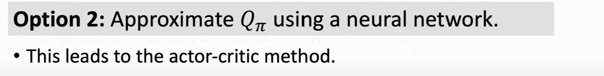

**算法**
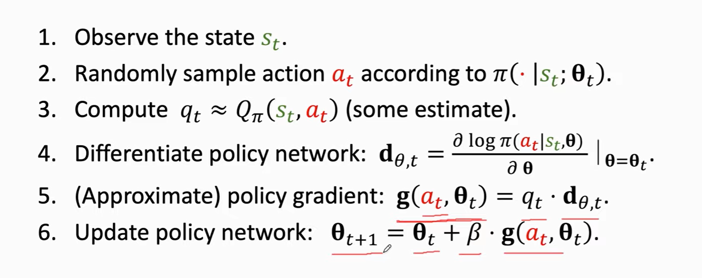

****

**Actor-Critic Method**

Key idea: Optimize state-value function.
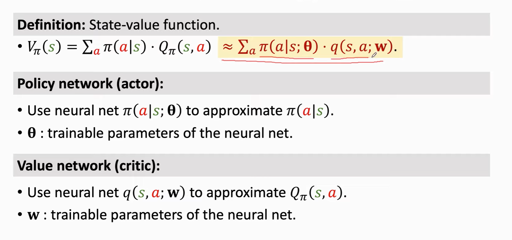

举一个**PolictNetwork**的例子
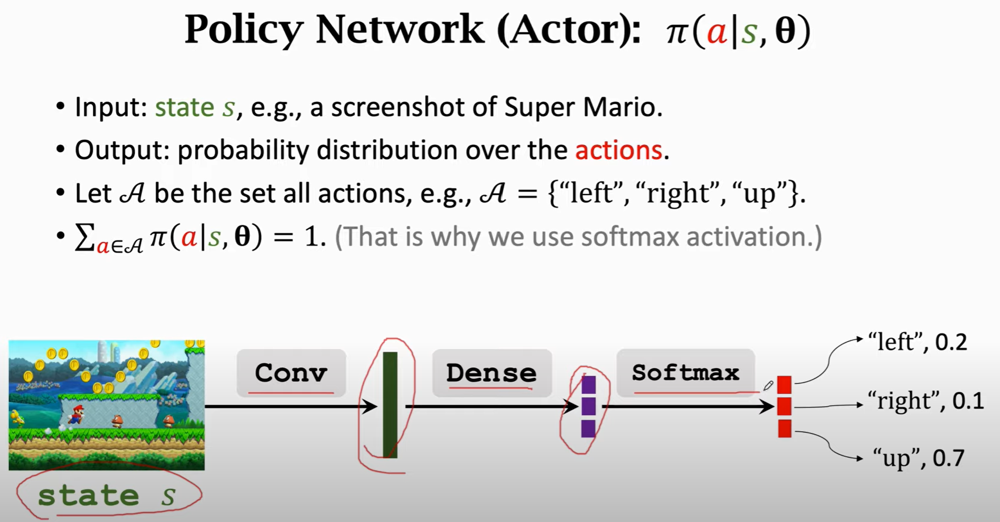

再举一个**Value Network**的例子
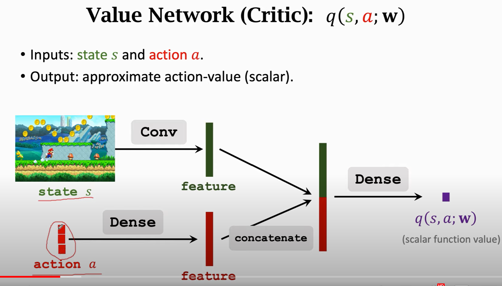

**总体算法**
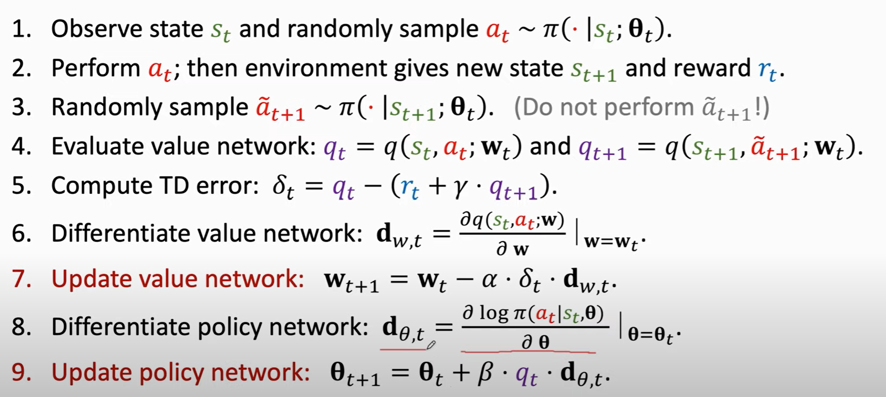
- 本质上就是上面的policy-based和value-based合在一起组合成新的network
- critic的训练监督信号完全来自于真**实的reward**.而actor的训练监督信号来自于**critic网络**
- 先value后policy。就是先裁判，再运动员
  
****

**Note**

现实中一般使用**with baseline**的算法（其实只是对上面这个第九步进行了微小调整）：
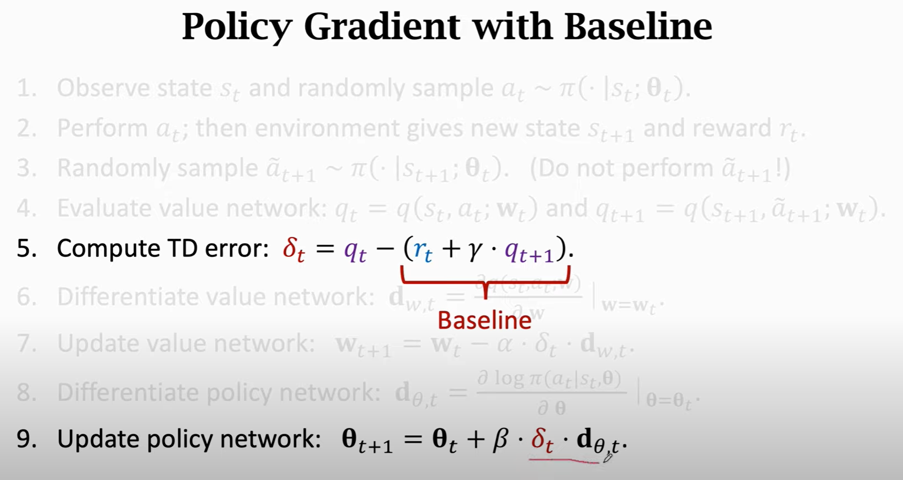

