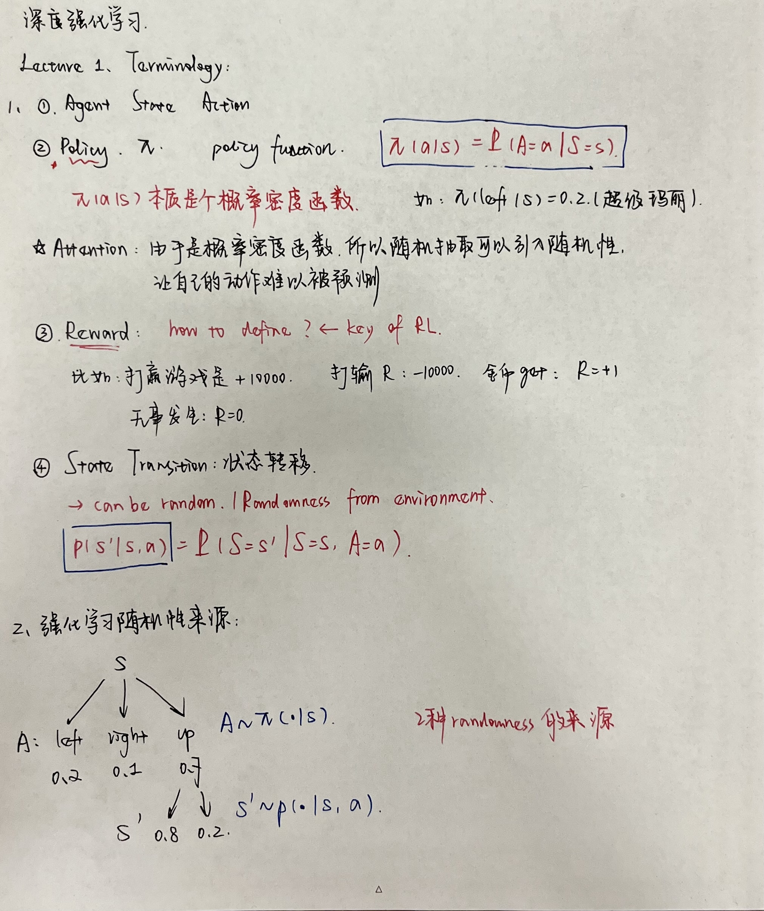
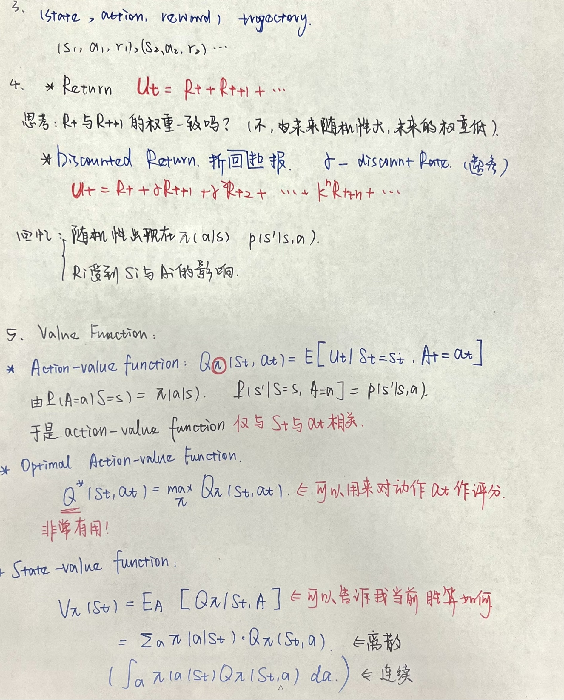
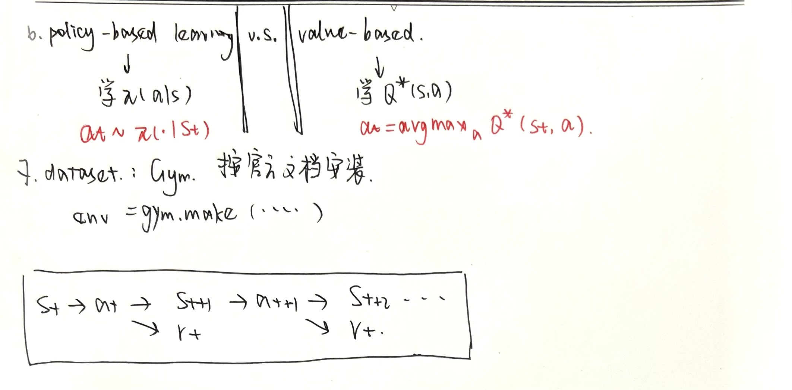

## Reinforcement Learning

[source](https://www.bilibili.com/video/BV1UE411G78S?spm_id_from=333.337.search-card.all.click&vd_source=9c6d95442eaa08adb6f5c78841910257)
[source2](https://www.youtube.com/watch?v=vmkRMvhCW5c)

### Lecture 1

**Why Reinforcement?**
- supervised : 很多时候人的决策也不一定是最优的。这样学出来的agent不一定是最厉害的(learning from **teacher**)
- reinforcement : learning from **experience**

In fact, alpha Go is a combination of Reinfrocement learning and supervised learning.

Other settings: chat-bot, interactive retrieval, auto-vehicle, text-generation.

****

**Terminology**

****

