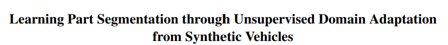
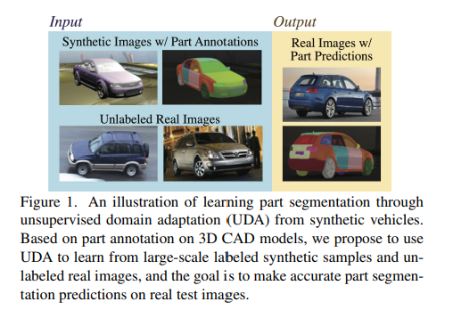
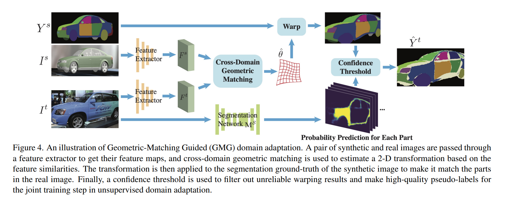

**CVPR 2022 ORAL**

****
[paper](https://arxiv.org/pdf/2103.14098.pdf)
**Setting**
给定某个category物体的synthetic data（已有part标注），希望实现在real上的part segmentaion

**Overview** 

核心是通过两个先验来构造监督信息尽可能真实的弱监督。

- warp部分，通过VGG网络，作为feature extractor提取到图片feature，基于transformer进行匹配。
- 精准的匹配需要能够寻找到appearance和viewpoint都尽可能相同的synthetic data. 所以在构造synthetic数据的时候，每一个model都在不同的角度进行了渲染。从synthetic中选取feature最能匹配上的那个作为用于warp的数据
- 利用synthetic data本身可以训练一个segmentation net.可以相信，这个网络给出的置信度比较高的部分，其预测是准确的
- 把segmentation net和warp后的结果综合起来，选取两者都approve的Pixel进行标注。就有了相对而言比较真实的标注。置信度低的位置不参加loss计算

