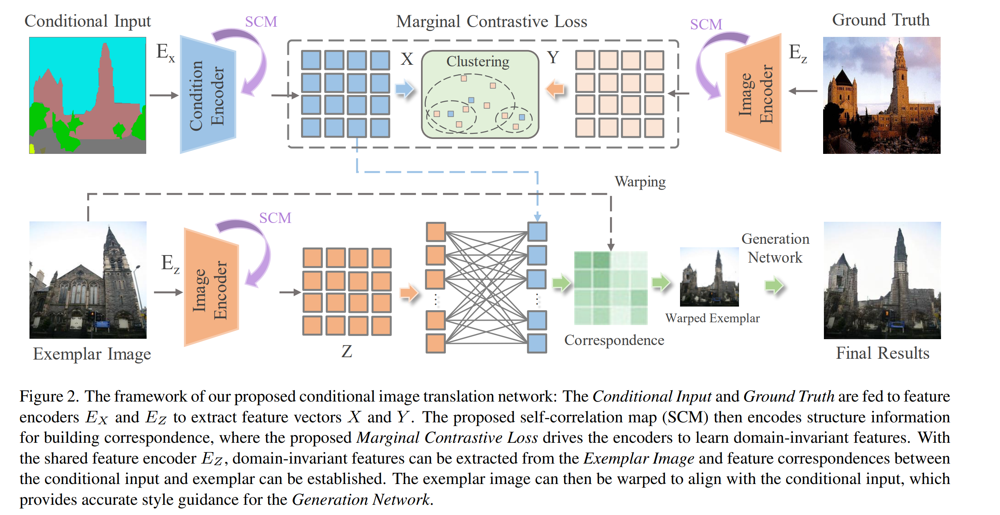
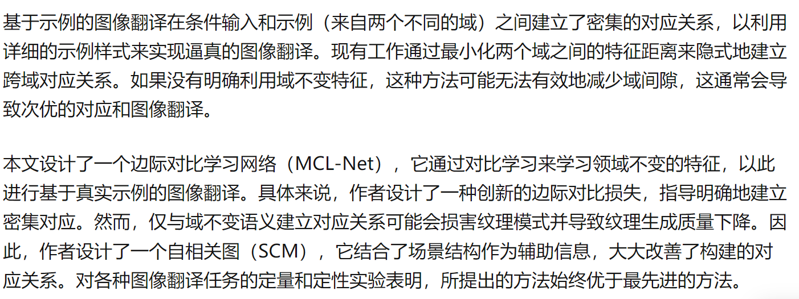
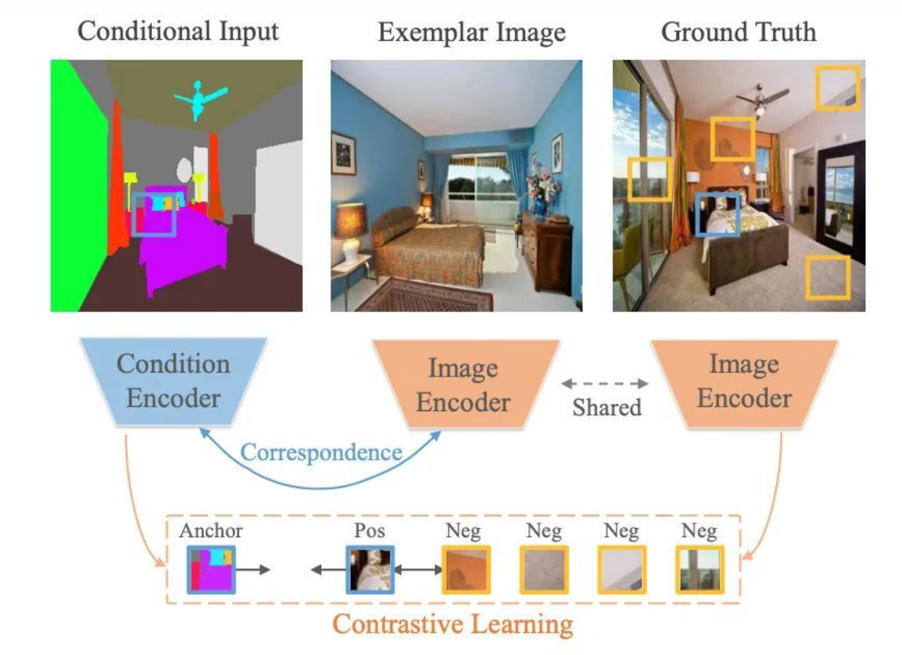

## Marginal Contrastive Correspondence for Guided Image Generation

 
- Marginal Contrastive Loss [click here](../loss_fn/marginal_contrastive_loss.md)
- SCM 我理解为一种获取全局info的手段。

来自知乎的评价

**密集匹配**

