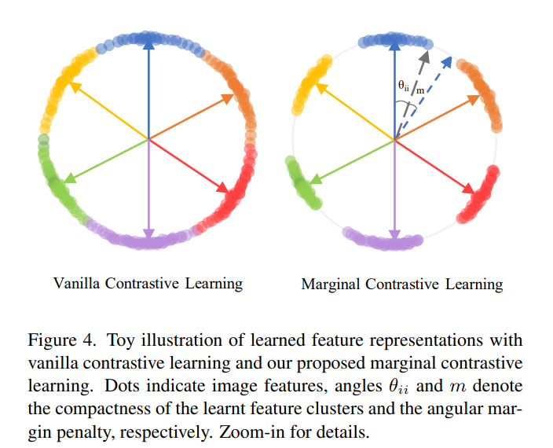

# Marginal Contrastive Loss

### Background
From: [Marginal Contrastive Correspondence for Guided Image Generation](https://arxiv.org/pdf/2204.00442). contrastive loss的一种。相比于原本contrastive loss的优点：

> The original contrastive learning tends to produce smooth transition between different feature clusters, which may incur smoothed and inaccurate correspondence. Inspired by the additive angular margin loss in ArcFace, we propose a marginal contrastive loss to enlarge the separability of features on a hyper-sphere, which yields more explicit and accurate correspondence.

### Details

  
     
#### vanilla和marginal的公式对比
vanilla Contrastive Learning:

##### Marginal Contrastive Learning loss计算方法：
vanilla Contrastive Learning:

实际使用的时候还可以加上hyper-sphere的半径：

